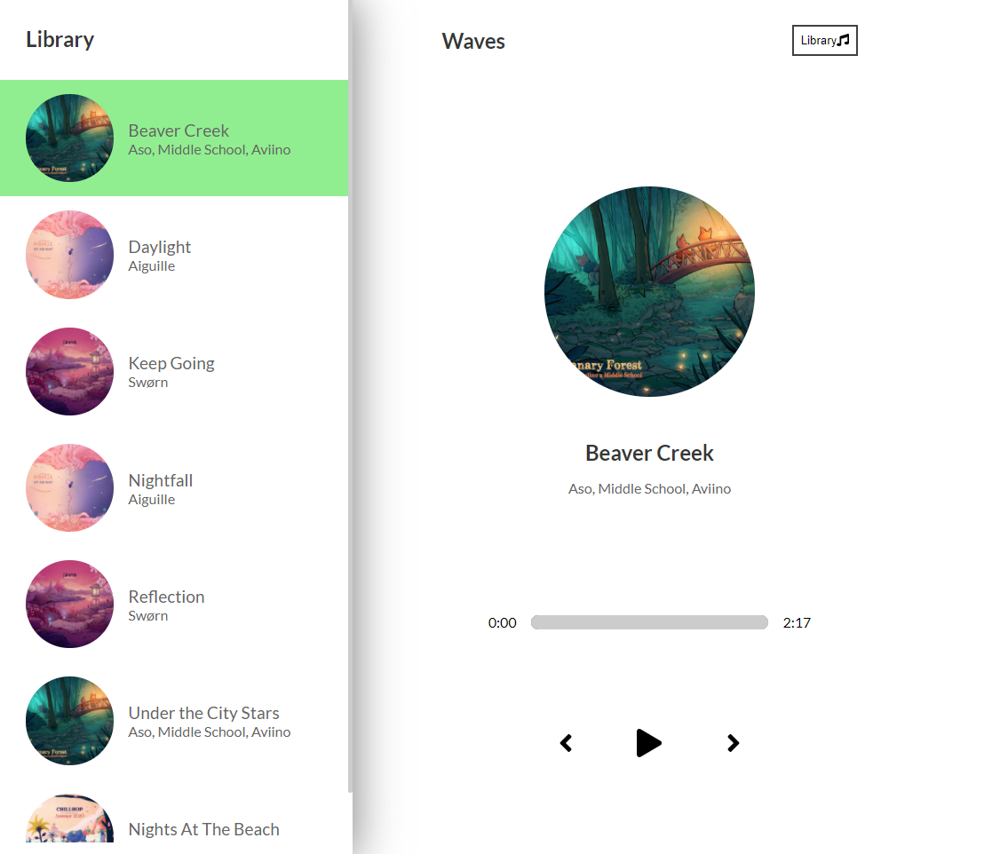

# Music player app

[](https://music-player-sigma-blond.vercel.app/)

React practise project.

### Details

Music sourced from **chillhop** all music used is free and streamed from the chillhop cdn.

App uses **`util.js`** as a hard coded API as there is no chillhop or music streaming API with all of the info needed for the custom UI elements.

### Data structure

```js
{
name: "Nights At The Beach",
cover: "https://chillhop.com/wp-content/uploads/2020/05/260a909fca701bbb7593f5f8f9cff9508cca2856-1024x1024.jpg",
artist: "Sitting Duck, Otaam",
audio: "https://mp3.chillhop.com/serve.php/?mp3=7947",
color: ["#FDE2CF", "#4BB7C4"],
id: uuidv4(),
active: false,
},
```

## Technologies used

-   React.js
-   scss

## Hosted at

-   vercel cloud deployment
-   shared hosting on my custom domain

## Setup

To run this project, install it locally using npm:

```bash
$ cd ../lorem
$ npm install
$ npm start
```

#### Page preview


